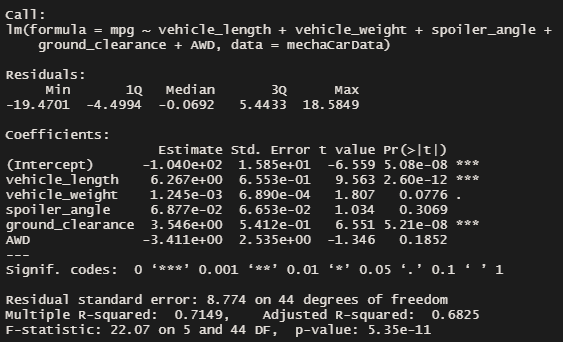
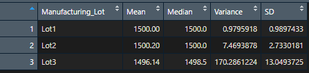
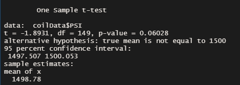
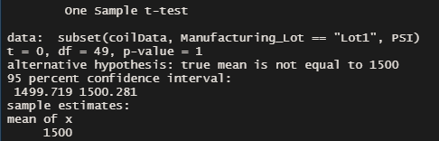
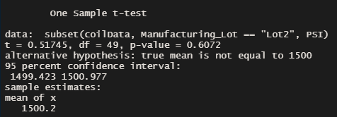
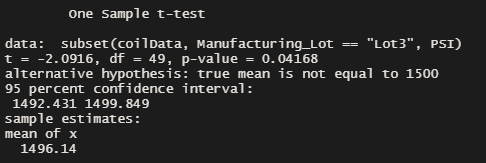

# MechaCar_Statistical_Analysis

## Overview
The primary analyst at AutosRUs, Jeremy, was tasked with analyzing the production data for a new car prototype, MechaCar.  The prototype is suffering from production issues, which are hindering the manufacturing team's progress.  Using the provided production data, I was tasked with discovering what variables affect the prototype's MPG and whether the suspension coils were being produced consistently within and between car lots.

## Results

### Linear Regression to Predict MPG
To determine which variables have the greatest effect on MPG, I performed a linear regression of MPG against all provided design specifications.  While assuming a significance threshold of 0.05, the following was determined from **Figure 1**:
-	The vehicle length and ground clearance variables were found to significantly predict MPG values, as did the intercept (p < 0.0001 in all cases).  The vehicle weight was trending significant (p = 0.0776).
-	The null hypothesis that the model's slope is 0 was rejected, because the p value for the overall model was much less than 0.05 (p = 5.35e-11).
-	The linear model predicted variance in MPG quite well, because the R-squared value suggest a strong correlation between the include variables and MPG (R-squared = 0.71).  However, the model is overfit, because it includes variables that were found to not significantly contribute to the variance in MPG.

**Figure 1:** Screenshot of the linear regression output

### Summary Statistics on Suspension
To determine whether the weight capacities of cars across lots is consistent, I looked at the mean, median, variance, and standard deviation of pounds per square inch (PSI) for all lots combined and each lot individually.  The design specifications dictate that the variance for the suspension coils must not exceed 100 PSI.  Given that specification, the following was determined:
-	The specifications for consistency were met across all lots combined (**Table 1**) and for lots 1 and 2 individually (**Table 2**).  However, Lot 3 has a variance of 170 PSI, and therefore failed the consistency specification (**Table 2**).

**Table 1:** Basic statistics for all cars across the three lots

**Table 2:** Basic statistics for all cars in each lot

### T-Tests on Suspension Coils
To determine whether any of the lots have a significantly different carrying capacity from the expected population mean of 1500 PSI, I performed a series of t-tests.  While assuming a significance threshold of 0.05, the following was determined:
-	There is no significant difference between the average PSI the suspension coil can support for all lots, or lots 1 and 2 individually and the population (P > 0.05 in all cases, **Figs 2-4**).  There is a significant difference between lot 3 and the population (p < 0.05, **Fig 5**).

**Figure 2:** T-test for all lots combined versus the expected population mean of 1500

**Figure 3:** T-test for lot 1 versus the expected population mean of 1500

**Figure 4:** T-test lot 2 versus the expected population mean of 1500

**Figure 5:** T-test for lot 3 versus the expected population mean of 1500

